# RNStarter

โปรเจกต์ตั้งต้นสำหรับแอป React Native (CLI, ไม่ใช่ Expo) ที่ติดตั้งและตั้งค่าไว้ครบ พร้อม component ภาษาไทย
ใช้ clone ไปเริ่มโปรเจกต์ใหม่ได้ทันที: rename -> ตั้ง `.env` -> รัน

- React Native 0.87.1 (New Architecture + Hermes), React 19.2, TypeScript 6
- ภาษาไทยเป็นหลัก (ไทย / อังกฤษ), ฟอนต์ Sarabun (เนื้อหา) + Kanit (หัวข้อ)
- light / dark mode, deep link, splash screen, token ที่เก็บใน Keychain
- component พร้อมใช้กว่า 40 ตัว + หน้า Component Gallery ไว้ดู / ทดสอบทุกตัว

## สารบัญ

- [ภาพหน้าจอ](#ภาพหน้าจอ)
- [Stack](#stack)
- [เครื่องที่ต้องมี](#เครื่องที่ต้องมี)
- [เริ่มใช้งาน](#เริ่มใช้งาน)
- [เริ่มโปรเจกต์ใหม่จาก starter นี้](#เริ่มโปรเจกต์ใหม่จาก-starter-นี้)
- [คำสั่งที่ใช้บ่อย](#คำสั่งที่ใช้บ่อย)
- [โครงสร้างโฟลเดอร์](#โครงสร้างโฟลเดอร์)
- [ตัวอย่าง component](#ตัวอย่าง-component)
- [แนวทางการเขียนโค้ด](#แนวทางการเขียนโค้ด)
- [การทดสอบ](#การทดสอบ)
- [Build สำหรับ release](#build-สำหรับ-release)
- [Workaround ที่ใส่ไว้ (อ่านก่อนอัปเกรด)](#workaround-ที่ใส่ไว้-อ่านก่อนอัปเกรด)
- [แก้ปัญหาที่พบบ่อย](#แก้ปัญหาที่พบบ่อย)

## ภาพหน้าจอ

ภาพจาก Android emulator (Android 17) ภาษาไทย ธีมสว่าง เว้นแต่ระบุ ตัวอย่างโค้ดของแต่ละ component อยู่ที่ [ตัวอย่าง component](#ตัวอย่าง-component)

<table>
  <tr>
    <td align="center">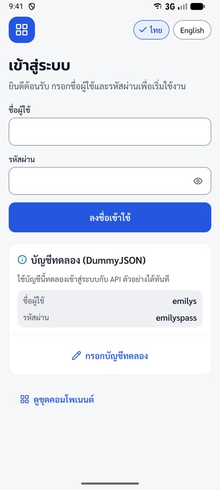<br>Login</td>
    <td align="center">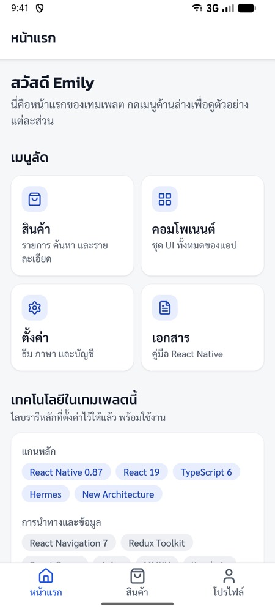<br>หน้าแรก</td>
    <td align="center">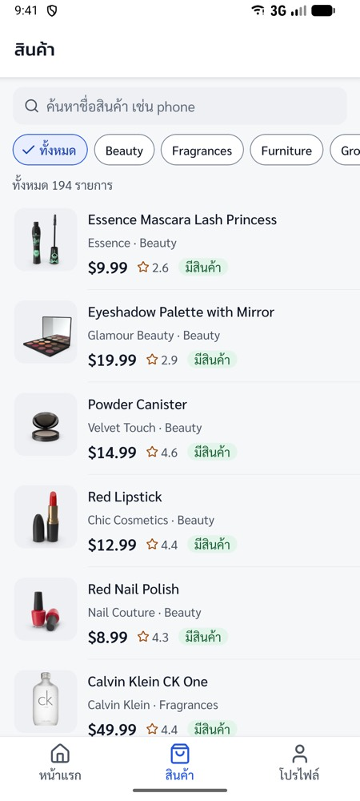<br>รายการสินค้า (ค้นหา / กรองหมวด)</td>
  </tr>
  <tr>
    <td align="center"><br>รายละเอียดสินค้า</td>
    <td align="center">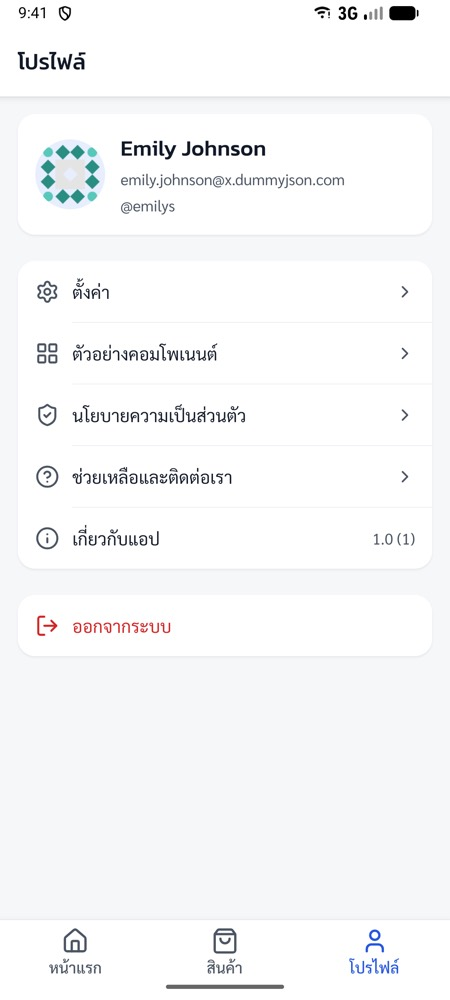<br>โปรไฟล์</td>
    <td align="center">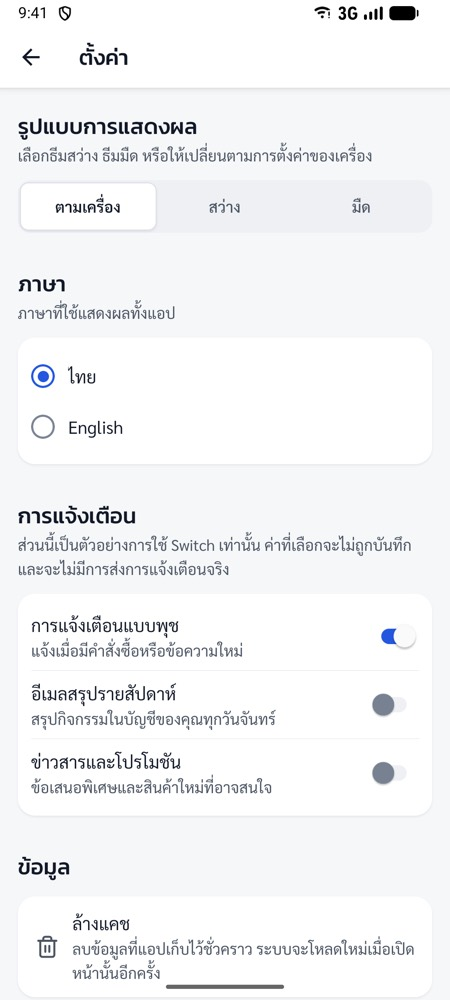<br>ตั้งค่า (ธีม / ภาษา / แจ้งเตือน)</td>
  </tr>
  <tr>
    <td align="center">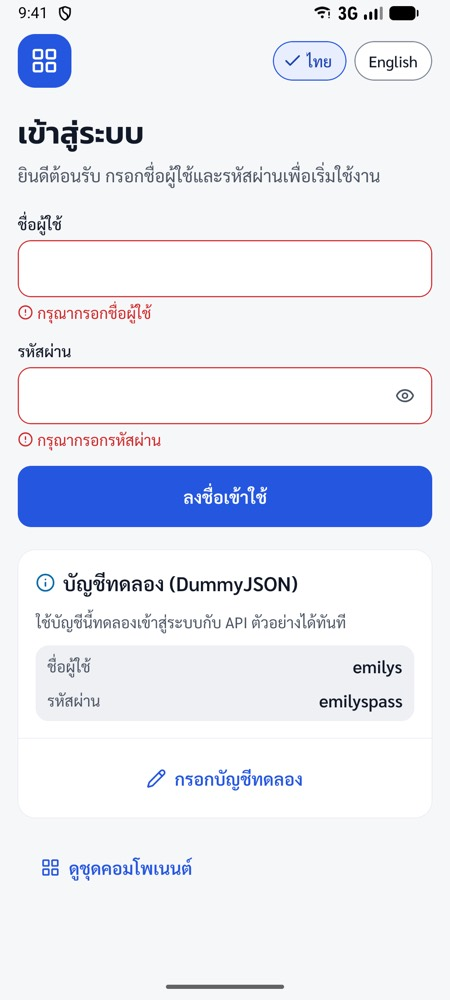<br>error ของฟอร์ม (zod + i18n)</td>
    <td align="center">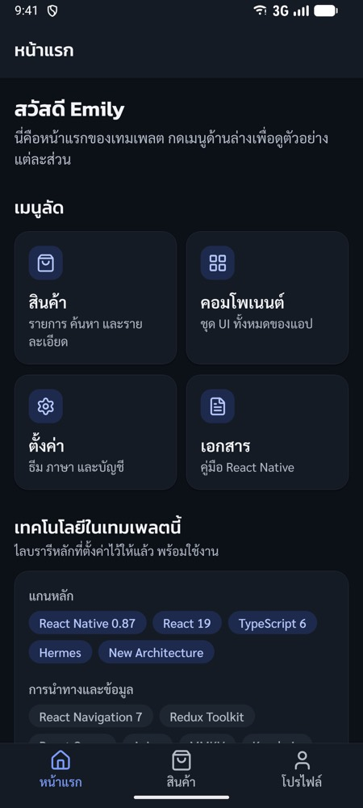<br>ธีมมืด: หน้าแรก</td>
    <td align="center">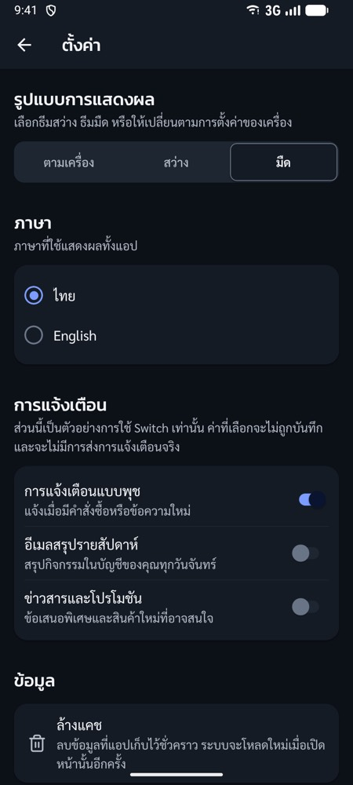<br>ธีมมืด: ตั้งค่า</td>
  </tr>
</table>

## Stack

| เรื่อง              | Library                                                                        | หมายเหตุ                                                |
| ------------------- | ------------------------------------------------------------------------------ | ------------------------------------------------------- |
| Navigation          | React Navigation 7 (native-stack + bottom-tabs)                                | dynamic API, typed routes, deep link                    |
| State (client)      | Redux Toolkit 2 + react-redux 9                                                | persist บาง slice ลง MMKV แบบ sync                      |
| State (server)      | TanStack React Query 5                                                         | ผูกกับ AppState / NetInfo แล้ว                          |
| HTTP                | axios 1.20 (pin version)                                                       | refresh token อัตโนมัติ, error รูปแบบเดียว (`ApiError`) |
| Storage             | react-native-mmkv 4                                                            | ค่าตั้งค่า / cache เล็ก ๆ                               |
| Secure storage      | react-native-keychain 10                                                       | access / refresh token                                  |
| Styling             | StyleSheet + theme tokens และ NativeWind 4 (Tailwind 3)                        | ใช้ร่วมกันได้ สีมาจาก token ชุดเดียว                    |
| Responsive          | react-native-responsive-screen + `useResponsive()`                             |                                                         |
| i18n                | i18next 26 + react-i18next 17 + react-native-localize                          | ไทย / อังกฤษ, key ถูกตรวจ type                          |
| วันที่              | dayjs (ปี พ.ศ.)                                                                |                                                         |
| Form                | react-hook-form 7 + zod 4                                                      | ข้อความ error แปลภาษาอัตโนมัติ                          |
| Animation / gesture | Reanimated 4.6 + Worklets 0.12, Gesture Handler 3                              |                                                         |
| Bottom sheet        | @gorhom/bottom-sheet 5                                                         |                                                         |
| Keyboard            | react-native-keyboard-controller                                               |                                                         |
| List                | @shopify/flash-list 2                                                          |                                                         |
| Icon                | lucide-react-native (ผ่าน react-native-svg)                                    |                                                         |
| อื่น ๆ              | webview, device-info, netinfo, bootsplash                                      |                                                         |
| Test                | Jest 29 + Testing Library RN 14, Maestro (E2E)                                 |                                                         |
| คุณภาพโค้ด          | ESLint (+ import-x, testing-library), Prettier, husky + lint-staged, GitLab CI |                                                         |

ไม่ได้ใส่ Firebase / Sentry / CodePush (ต้องมี config จริงก่อน build) จุดที่ต่อเพิ่มได้: `src/utils/logger.ts`, `src/app/ErrorBoundary.tsx`

## เครื่องที่ต้องมี

| เครื่องมือ       | เวอร์ชัน                                       | หมายเหตุ                                                                                                                                                            |
| ---------------- | ---------------------------------------------- | ------------------------------------------------------------------------------------------------------------------------------------------------------------------- |
| Node             | >= 22.22.1                                     | ดู `.nvmrc` (lint-staged 17 ต้องการ)                                                                                                                                |
| Xcode            | 27                                             | ถ้า `xcode-select -p` ชี้ไป CommandLineTools ให้รัน `sudo xcode-select -s /Applications/Xcode.app/Contents/Developer` หรือ export `DEVELOPER_DIR` ก่อนรันคำสั่ง iOS |
| Ruby / CocoaPods | ใช้ผ่าน `bundle exec`                          | ไม่ต้องติดตั้ง `pod` เอง: `bundle install` ครั้งแรก (ลง gem ใน `vendor/bundle`) แล้วใช้ `npm run pods`                                                              |
| JDK              | 17                                             | JBR 21 ของ Android Studio ใช้ได้: Gradle ดาวน์โหลด JDK 17 ให้เองตอน build ครั้งแรก (ต้องมีเน็ต) `npx react-native doctor` จะเตือนเรื่อง JDK 21 ซึ่งไม่เป็นไร        |
| Android SDK      | Platform 37, Build-Tools 37, NDK 27.1.12297006 | Gradle ติดตั้งให้เองถ้าไม่มี                                                                                                                                        |
| Maestro          | 2.x                                            | เฉพาะถ้าจะรัน E2E                                                                                                                                                   |
| Watchman         | ไม่บังคับ                                      | `brew install watchman` ช่วยให้ Metro เร็วขึ้น                                                                                                                      |

## เริ่มใช้งาน

```sh
npm install            # ติดตั้ง + apply patch ใน patches/ อัตโนมัติ (postinstall)
cp .env.example .env   # แก้ค่าตามต้องการ (ไม่ใส่ก็รันได้ ใช้ค่า default)
bundle install         # iOS ครั้งแรก: ลง CocoaPods ตาม Gemfile (ไม่งั้น npm run pods ขึ้น command not found: pod)
npm run pods           # iOS
npm start              # Metro
npm run ios            # อีก terminal
npm run android
```

บัญชีทดลอง (DummyJSON): `emilys` / `emilyspass` (หน้า Login มีปุ่มกรอกให้)

## เริ่มโปรเจกต์ใหม่จาก starter นี้

1. copy / clone แล้วสร้าง git repo ใหม่ (commit ครั้งแรกก่อน: เครื่องมือ rename ต้องการ git status ที่สะอาด)
2. เปลี่ยนชื่อแอปและ bundle id (ใช้ชื่อแบบ PascalCase ไม่มีช่องว่าง)
   ```sh
   npx react-native-rename@3.3.2 "AcmeShop" -b com.acme.shop
   ```
3. แก้เองหลัง rename (เครื่องมือไม่ได้แก้ให้)
   - ชื่อที่แสดงบนเครื่อง: `app.json` (`displayName`), `android/app/src/main/res/values/strings.xml` (`app_name`), `ios/<App>/Info.plist` (`CFBundleDisplayName`)
   - deep link scheme `rnstarter`: `ios/<App>/Info.plist` (`CFBundleURLSchemes`), `android/app/src/main/AndroidManifest.xml` (`android:scheme`), `src/navigation/linking.ts` (`prefixes`)
   - ชื่อ module ใน `ios/<App>/AppDelegate.swift` (`withModuleName`) และ `android/app/src/main/java/<package>/MainActivity.kt` (`getMainComponentName`) ต้องตรงกับ `app.json` `name` (rename แก้ให้แล้ว ตรวจอีกครั้ง)
   - `appId` ใน `maestro/*.yaml` และ `maestro/subflows/*.yaml` ให้ตรงกับ bundle id ใหม่ (ไม่งั้น E2E หาแอปไม่เจอ)
4. ล้างของเก่าแล้วติดตั้งใหม่
   ```sh
   rm -rf ios/Pods ios/build && npm install && bundle install && npm run pods
   cd android && ./gradlew clean && cd ..
   watchman watch-del-all   # ถ้ามี watchman
   ```
5. เปลี่ยน brand: สีหลักใน `src/theme/colors.ts` (คำนวณ contrast ใหม่ `npm test` จะตรวจให้), โลโก้ `src/assets/brand/logo.svg` แล้ว `npm run bootsplash`, ไอคอนแอปใน `android/app/src/main/res/mipmap-*` และ `ios/<App>/Images.xcassets/AppIcon.appiconset`
6. ลบตัวอย่างที่ไม่ใช้: `src/features/products` (+ `queryKeys.products`, namespace `products`), ปรับ `src/features/auth/api/authApi.ts` ให้ชี้ API จริง
7. Android release: สร้าง keystore ตาม `android/keystore.properties.example`

## คำสั่งที่ใช้บ่อย

| คำสั่ง                                                | ทำอะไร                                                                                          |
| ----------------------------------------------------- | ----------------------------------------------------------------------------------------------- |
| `npm start` / `npm run start:reset`                   | Metro (ใช้ `start:reset` หลังแก้ `.env`, `babel.config.js`, `tailwind.config.js`)               |
| `npm run start:staging`                               | Metro ด้วย `APP_ENV=staging` (อ่าน `.env.staging`)                                              |
| `npm run ios` / `npm run android`                     | build + เปิดแอป                                                                                 |
| `npm run pods`                                        | `bundle exec pod install`                                                                       |
| `npm run verify`                                      | typecheck + lint + test (ชุดเดียวกับ CI)                                                        |
| `npm run typecheck` / `lint` / `lint:fix` / `format`  |                                                                                                 |
| `npm test` / `test:watch` / `test:coverage`           | Jest                                                                                            |
| `npm run e2e`                                         | Maestro ทุก flow ใน `maestro/` (ต้องเปิดแอปใน simulator / emulator ก่อน)                        |
| `npm run link-assets`                                 | link ฟอนต์ใน `src/assets/fonts` เข้า iOS / Android (หลังเพิ่ม / ลบฟอนต์ แล้ว build native ใหม่) |
| `npm run bootsplash`                                  | สร้าง splash ใหม่จาก `src/assets/brand/logo.svg` (แล้ว `npm run pods`)                          |
| `npm run patch:nitro` / `patch:css-interop`           | สร้างไฟล์ patch ใหม่หลังแก้ไฟล์ใน node_modules (ดู workaround ด้านล่าง)                         |
| `npm run clean:android` / `clean:ios` / `clean:metro` | ล้าง cache                                                                                      |

## โครงสร้างโฟลเดอร์

```
src/
  app/            App.tsx, bootstrap (งานก่อน render แรก), providers, ErrorBoundary
  navigation/     RootNavigator (สลับหน้าตาม auth), MainTabs, types, linking, navigationRef
  features/       แยกตาม feature: api/ hooks/ screens/ components/ __tests__/
    auth/ home/ products/ profile/ settings/ webview/ gallery/
  components/ui/  component กลาง (import จาก '@/components/ui')
  theme/          tokens (สี, ตัวอักษร, ระยะ), ThemeProvider, makeStyles, responsive, NativeWind vars
  store/          Redux store, slices, persistence (MMKV), listeners
  services/       api (axios + errors), auth (tokenStorage), query (React Query), storage (MMKV)
  i18n/           ตั้งค่า i18next + locales/{th,en}/<namespace>.json
  hooks/          hook ทั่วไป (debounce, app state, network, refresh ...)
  utils/          format (เงิน, วันที่ พ.ศ., เบอร์โทร), validation (บัตรประชาชน ฯลฯ), zod schemas, logger
  config/env.ts   ค่า .env ที่ตรวจแล้ว (ใช้ตัวนี้ ไม่ import '@env' ตรง ๆ)
  assets/         fonts/ (link เข้า native), brand/, bootsplash/, licenses/ (OFL ของฟอนต์)
  test-utils/     renderWithProviders, renderScreen
__tests__/        smoke test ของแอป, theme, tailwind config, unit/
jest/             setup (mock native module), resolver
maestro/          E2E flows
patches/          patch-package
```

## ตัวอย่าง component

import ทุกตัวจาก `@/components/ui` ดูครบทุก variant / สถานะได้ที่หน้า **Component Gallery** ในแอป (หน้า Login > "ดูชุดคอมโพเนนต์", โปรไฟล์ > "ตัวอย่างคอมโพเนนต์" หรือ `rnstarter://gallery`) โค้ดของหน้านี้อยู่ใน `src/features/gallery/sections/` ใช้เป็นตัวอย่างได้ทั้งหมด

<table>
  <tr>
    <td align="center">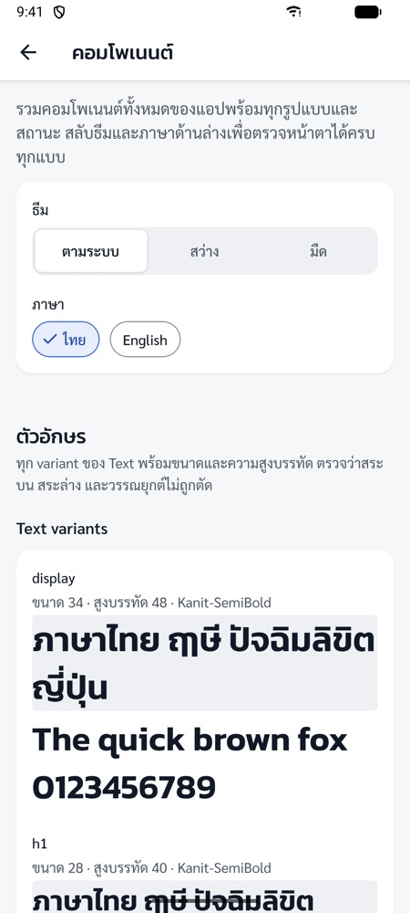<br>Gallery: สลับธีม / ภาษา, Text</td>
    <td align="center">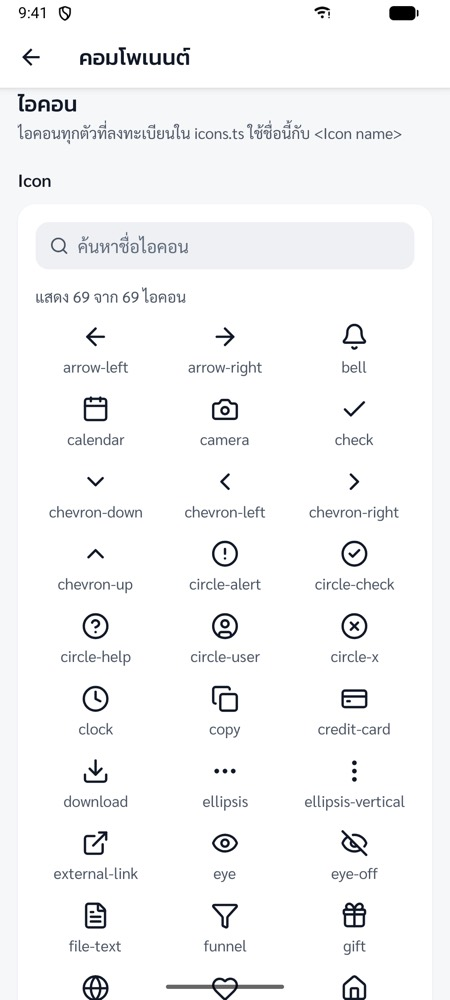<br>Icon</td>
    <td align="center">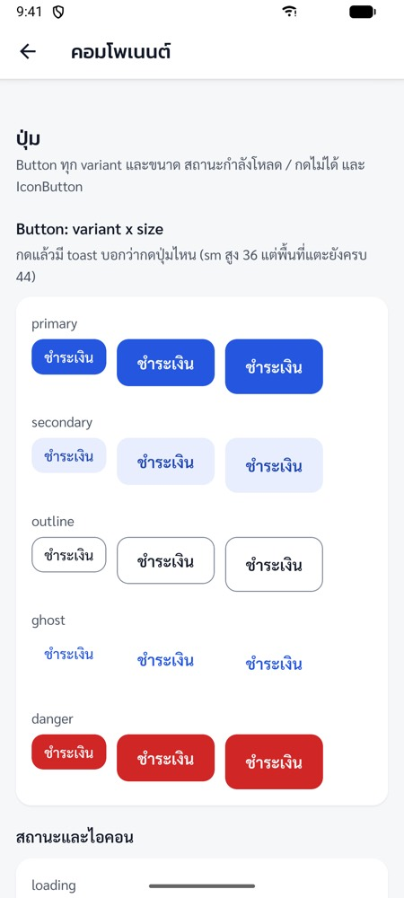<br>Button</td>
  </tr>
  <tr>
    <td align="center">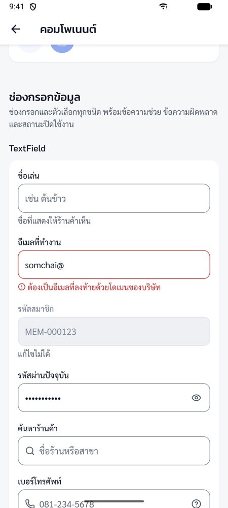<br>TextField</td>
    <td align="center">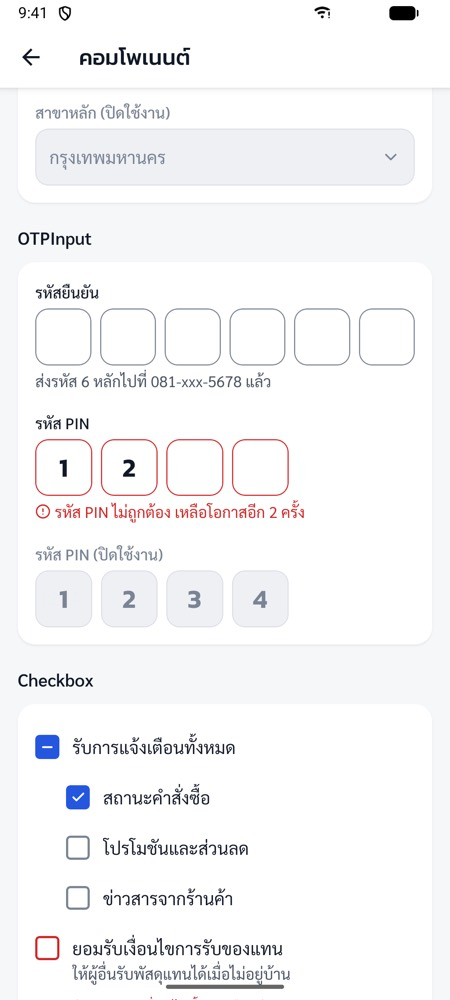<br>OTPInput, Checkbox</td>
    <td align="center">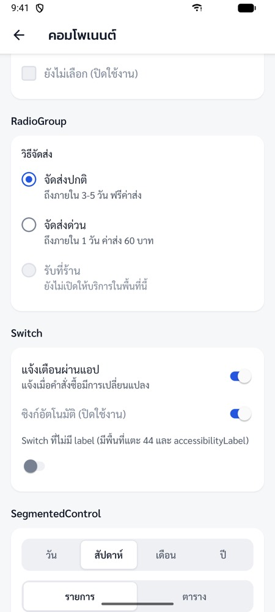<br>RadioGroup, Switch, SegmentedControl</td>
  </tr>
  <tr>
    <td align="center">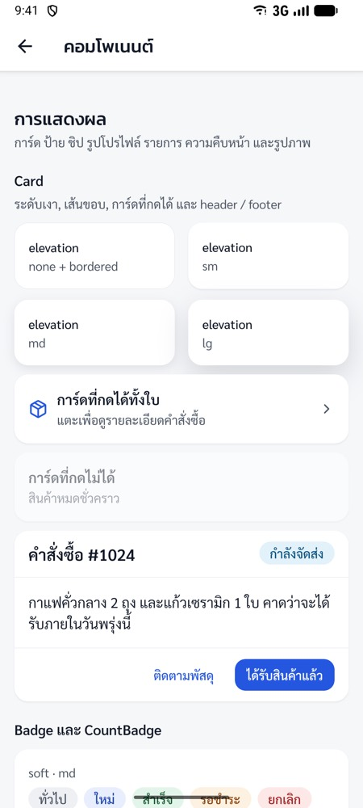<br>Card</td>
    <td align="center">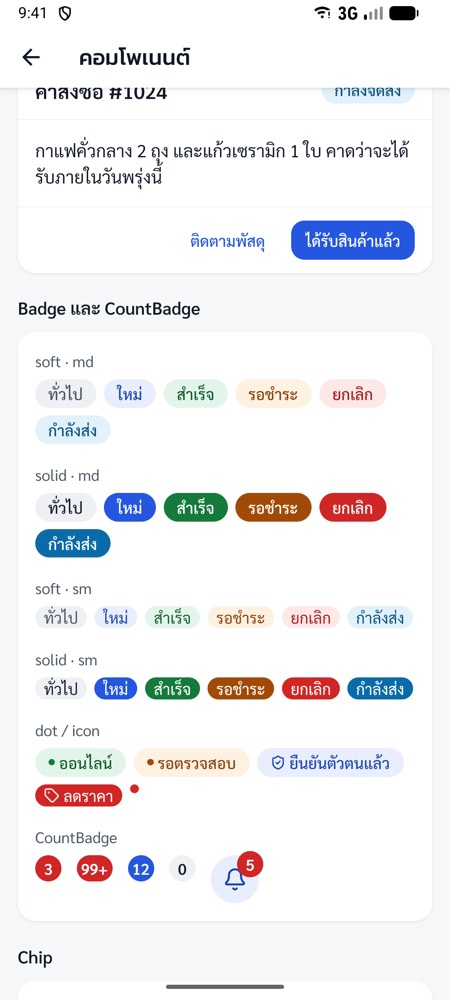<br>Badge, CountBadge</td>
    <td align="center">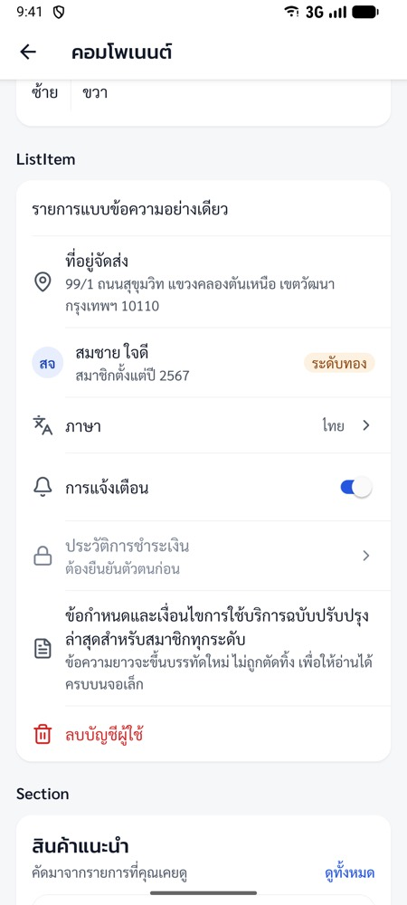<br>ListItem</td>
  </tr>
  <tr>
    <td align="center">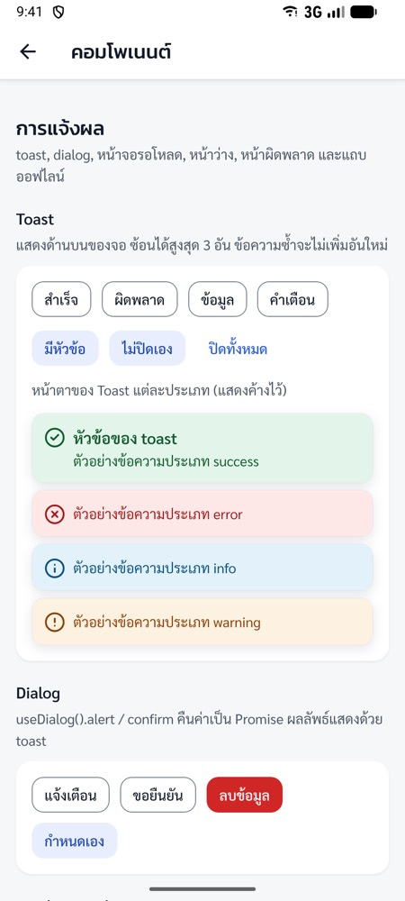<br>Toast</td>
    <td align="center">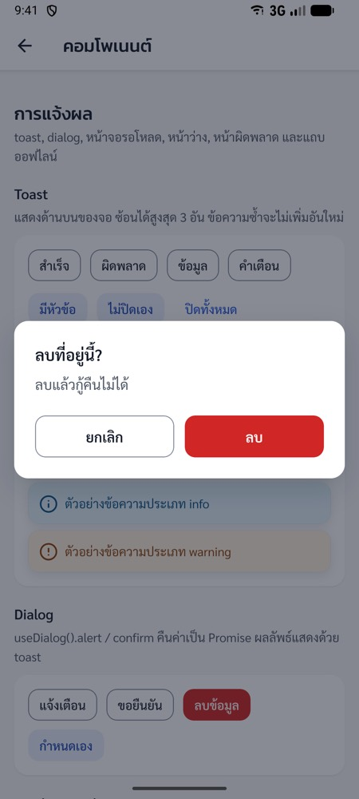<br>Dialog (confirm)</td>
    <td align="center">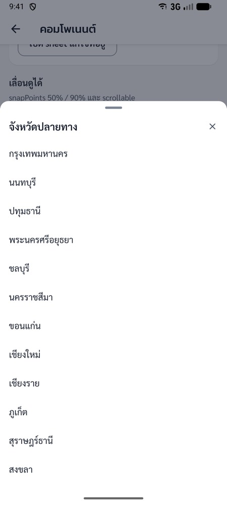<br>Select (BottomSheet)</td>
  </tr>
</table>

### ตัวอักษร / Icon / ปุ่ม

```tsx
<Text variant="h2">หัวข้อ</Text>
<Text variant="body" color="textSecondary">ข้อความรอง</Text>
<Text variant="label" weight="semibold">ป้ายชื่อ</Text>

<Icon name="bell" size="md" color="primary" />

<Button title="ชำระเงิน" onPress={pay} />
<Button title="ยกเลิก" variant="outline" size="sm" onPress={cancel} />
<Button title="กำลังบันทึก" loading />
<Button title="ใส่ตะกร้า" left={<Icon name="shopping-cart" color="onPrimary" />} fullWidth onPress={addToCart} />
<IconButton icon="heart" accessibilityLabel="ถูกใจ" onPress={like} />
```

- `variant` ของ Button: `primary` / `secondary` / `outline` / `ghost` / `danger`, `size`: `sm` / `md` / `lg`
- `variant` ของ Text อยู่ใน `typeScale` (`display`, `h1`-`h3`, `title`, `body`, `bodySmall`, `label`, `caption` ...) ขนาดไทยไม่ต่ำกว่า 14

### ช่องกรอกข้อมูล

```tsx
<TextField label="อีเมล" value={email} onChangeText={setEmail} keyboardType="email-address" errorText={emailError} />
<TextField label="รหัสผ่าน" type="password" value={password} onChangeText={setPassword} />
<TextField label="ค้นหาร้านค้า" leftIcon="search" clearable value={query} onChangeText={setQuery} />

<Select
  label="จังหวัด"
  options={[{ label: 'กรุงเทพมหานคร', value: 'bkk' }, { label: 'เชียงใหม่', value: 'cnx' }]}
  value={province}
  onChange={setProvince}
/>

<OTPInput label="รหัสยืนยัน" length={6} onComplete={verify} />
<Checkbox label="ยอมรับเงื่อนไข" checked={accepted} onChange={setAccepted} />
<RadioGroup
  label="วิธีจัดส่ง"
  options={[{ label: 'จัดส่งปกติ', value: 'normal' }, { label: 'จัดส่งด่วน', value: 'express' }]}
  value={shipping}
  onChange={setShipping}
/>
<Switch label="แจ้งเตือนผ่านแอป" value={notify} onValueChange={setNotify} />
<SegmentedControl
  options={[{ label: 'วัน', value: 'day' }, { label: 'สัปดาห์', value: 'week' }]}
  value={range}
  onChange={setRange}
/>
```

- ทุกช่องมี `label` / `helperText` / `errorText` / `disabled` เหมือนกัน
- ใช้กับ react-hook-form: `FormTextField` / `FormSelect` / `FormOTPInput` / `FormCheckbox` (ดู [Form](#form))

### การแสดงผล

```tsx
<Card header={<Text variant="title">คำสั่งซื้อ #1024</Text>} onPress={openOrder}>
  <Text>กาแฟคั่วกลาง 2 ถุง</Text>
</Card>

<Badge label="สำเร็จ" status="success" />
<Badge label="ยกเลิก" status="danger" variant="solid" />
<Chip label="ใกล้ฉัน" icon="map-pin" selected={nearby} onPress={toggleNearby} />
<Avatar uri={user.image} name="สมชาย ใจดี" size="md" />
<ListItem left="languages" title="ภาษา" value="ไทย" chevron onPress={openLanguage} />
<Skeleton lines={3} />
```

- Avatar ที่ไม่มีรูปแสดงตัวย่อจากชื่อ (ชื่อไทย "สมชาย ใจดี" -> "สจ")

### แจ้งเตือน / Dialog / BottomSheet

```tsx
const toast = useToast();
toast.success('บันทึกแล้ว');
toast.error('บันทึกไม่สำเร็จ', { title: 'ผิดพลาด' });

const dialog = useDialog();
const ok = await dialog.confirm({
  title: 'ลบที่อยู่นี้?',
  message: 'ลบแล้วกู้คืนไม่ได้',
  destructive: true,
});

const sheetRef = useRef<BottomSheetRef>(null);
<Button title="ตัวกรอง" onPress={() => sheetRef.current?.present()} />
<BottomSheet ref={sheetRef} title="ตัวกรอง" snapPoints={['50%']}>
  ...
</BottomSheet>

<EmptyState icon="shopping-cart" title="ยังไม่มีสินค้าในตะกร้า" actionLabel="เลือกซื้อสินค้า" onAction={goShopping} />
<ErrorState error={error} onRetry={refetch} />
```

- `useToast` / `useDialog` ใช้ได้ทุกหน้าจอ (provider อยู่ใน `AppProviders`)
- `ErrorState` แปลข้อความจาก `error.kind` ของ `ApiError` ให้เอง

## แนวทางการเขียนโค้ด

### Theme และภาษาไทย

- สีทั้งหมดมาจาก `src/theme/colors.ts` (light / dark) ห้ามใส่ hex ในหน้าจอ ทุกคู่สีผ่าน contrast 4.5:1 และมี test ตรวจ (`__tests__/theme.test.ts`) ถ้าเปลี่ยนสีให้รัน `npm test`
- ข้อความใช้ `<Text variant="body" color="textSecondary" weight="semibold">` จาก `@/components/ui` เสมอ (ESLint ห้าม import `Text` ของ react-native)
- ขนาดตัวอักษรไทยต่ำสุด 14 และ lineHeight ประมาณ 1.5 เท่า (กันสระ / วรรณยุกต์ถูกตัด) อยู่ใน `typeScale` แล้ว
- **ห้ามใช้ `fontWeight` / `fontStyle` / `font-bold` / `italic`** กับฟอนต์ของแอป: Android จะหาไฟล์ `<ฟอนต์>_bold.ttf` ไม่เจอแล้วเปลี่ยนเป็นฟอนต์ระบบแบบเงียบ ๆ (iOS ดูปกติ) ให้เลือกน้ำหนักผ่าน `weight` / `font-body-bold` แทน ESLint ตรวจทั้งสองแบบ
- ระยะ / มุมโค้ง / ขนาดมาตรฐาน: `theme.spacing`, `theme.radius`, `theme.sizes` (พื้นที่แตะขั้นต่ำ 44)
- ภาษาเริ่มต้นเป็นไทยเสมอจนกว่าผู้ใช้จะเลือกเอง (มือถือคนไทยจำนวนมากตั้งเครื่องเป็นอังกฤษ) ถ้าอยากให้ตามภาษาเครื่อง ตั้ง `FOLLOW_DEVICE_LANGUAGE = true` ใน `src/i18n/languages.ts`
- ภาษาที่ใช้จริงมาจากตัวเลือกในแอป (Settings / หน้า Login) เท่านั้น: Android ไม่ได้เปิด per-app language ของระบบ ส่วน iOS ยังมีตัวเลือกภาษาของแอปใน Settings ของเครื่อง (จาก `CFBundleLocalizations`) ซึ่งเปลี่ยนแค่ข้อความของระบบ เช่น ปุ่ม Back

### StyleSheet กับ NativeWind (ใช้ร่วมกันได้)

```tsx
// className สำหรับ layout / พื้นหลัง / ขอบ
<View className="flex-1 gap-4 bg-surface p-4 rounded-lg border border-border">
  {/* ตัวอักษรใช้ props ของ Text */}
  <Text variant="h3">หัวข้อ</Text>
</View>;

// makeStyles เมื่อค่าขึ้นกับ theme ใน JS
const useStyles = makeStyles(theme => ({
  card: { backgroundColor: theme.colors.surface, ...theme.shadows.md },
}));
```

- ถ้าใส่ทั้ง `className` และ `style` ค่าใน `style` ชนะ
- สีของ class เป็นชื่อ token (`bg-primary`, `text-fg-secondary`, `border-border-strong` ดูรายชื่อใน `src/theme/tailwindColors.js`) ไม่มี palette ของ Tailwind (`bg-blue-500`) สีสลับ light / dark ตาม Settings ของแอปเองผ่าน CSS variables จึงแทบไม่ต้องใช้ `dark:`
- `text-*` ใช้ขนาดเดียวกับ typeScale (`text-body`, `text-h3` ...) ไม่มี `text-xs`
- `<Text>` ของแอปตั้งฟอนต์ / สี / ขนาดผ่าน style เสมอ className ด้านตัวอักษรบน `<Text>` จึงไม่มีผล ให้ใช้ props
- `Pressable` ที่ใช้ `style` แบบ function (`style={({ pressed }) => ...}`) ต้องใส่ `cssInterop={false}` ไม่งั้น NativeWind v4 ทิ้ง style ทั้งหมดบนเครื่องจริง (ปุ่มไม่มีพื้นหลัง) ESLint บังคับกฎนี้ ([nativewind#1105](https://github.com/nativewind/nativewind/issues/1105))
- Jest ไม่ได้เปิด NativeWind (interop ปิดเมื่อ `NODE_ENV=test`) test ผ่านไม่ได้แปลว่า className แสดงผลถูก ต้องดูบนเครื่อง (หน้า Component Gallery มี section NativeWind ไว้ตรวจ)
- แก้ `tailwind.config.js` แล้วต้อง `npm run start:reset`

### เพิ่มหน้าจอใหม่

1. เพิ่ม route + params ใน `src/navigation/types.ts`
2. สร้าง `src/features/<feature>/screens/XxxScreen.tsx`
3. ลงทะเบียนใน `RootNavigator.tsx` (หรือ `MainTabs.tsx`) ในกลุ่มที่ถูกต้อง (ก่อน / หลัง login / ทั้งสองแบบ)
4. ถ้าต้องเปิดจาก deep link เพิ่ม path ใน `src/navigation/linking.ts`
5. ข้อความใส่ใน `src/i18n/locales/{th,en}/<namespace>.json` (namespace ใหม่ต้อง import ใน `src/i18n/resources.ts`) test จะตรวจว่า key ไทย / อังกฤษตรงกัน

### เรียก API

- เขียน API ใน `src/features/<feature>/api/*.ts` ผ่าน `apiClient` (แนบ token, refresh เมื่อได้ 401, แปลง error เป็น `ApiError`)
- ใช้ผ่าน React Query ใน `hooks/` key มาจาก `src/services/query/queryKeys.ts`
- หน้าจอแสดง error ด้วย `<ErrorState error={error} onRetry={refetch} />` (แปลข้อความตาม `error.kind` ให้)
- token อยู่ใน Keychain (`tokenStorage`) ไม่ใช่ Redux / MMKV

### State

- server data -> React Query, client state -> Redux slice ใน `src/store/slices`
- slice ที่ต้องจำหลังปิดแอป: เพิ่มชื่อใน `PERSIST_WHITELIST` (`src/store/persistence.ts`) เปลี่ยนโครงสร้างแบบไม่เข้ากันกับของเดิมให้เพิ่ม `PERSIST_VERSION`
- side effect ที่ผูกกับ action: `src/store/listeners.ts`

### Form

```tsx
const { control, handleSubmit } = useForm<LoginFormValues>({ resolver: zodResolver(loginSchema) });
<FormTextField control={control} name="username" label={t('auth:username')} errorValues={{ count: USERNAME_MIN_LENGTH }} />
<Button title="..." onPress={() => handleSubmit(onSubmit)()} />
```

- ข้อความ error ของ schema เป็น i18n key (`validation:email`) wrapper แปลให้
- ส่ง `handleSubmit(onSubmit)` เข้า `onPress` ตรง ๆ ไม่ได้ (type ของ RN 0.87 ไม่ตรง) ให้ห่อด้วย arrow function

### Icon / ฟอนต์ / env

- icon: เพิ่มใน `src/components/ui/icons.ts` แล้วใช้ `<Icon name="house" />` (ห้าม import จาก `lucide-react-native` ตรง ๆ: bundle ใหญ่ขึ้นราว 1.8 MB)
- ฟอนต์: วางไฟล์ `.ttf` ใน `src/assets/fonts` (ชื่อไฟล์ = PostScript name) -> `npm run link-assets` -> build native ใหม่
- env: เพิ่มตัวแปรใน `.env.example`, `src/types/env.d.ts`, `src/config/env.ts` ค่าถูกฝังใน JS bundle ห้ามใส่ secret แก้ `.env` แล้วต้อง `npm run start:reset` และ `npx jest --clearCache`
- env แยกตามโหมด: อ่าน `.env` แล้วทับด้วย `.env.<โหมด>` ถ้ามีไฟล์ (`.env.staging` ตอน `npm run start:staging`, `.env.production` ตอน build release เพราะ `react-native bundle` ตั้ง `NODE_ENV=production`) ถ้าไม่มี `.env.production` build release จะได้ค่าจาก `.env` (`APP_ENV=development`)

## การทดสอบ

- `npm test`: unit (utils, API client, persistence, i18n), component (`src/components/ui/__tests__`), หน้าจอ (`src/features/*/__tests__`), smoke test ทั้งแอป
- render ด้วย `renderWithProviders` (component) หรือ `renderScreen` (หน้าจอใน NavigationContainer จริง)
- Testing Library v14: `render` / `fireEvent` / `act` เป็น async ต้อง `await`
- เพิ่ม native library ใหม่: ใส่ mock ใน `jest/setup.js` และถ้าส่ง ESM ให้เพิ่มชื่อใน `esmPackages` ของ `jest.config.js`
- E2E (Maestro): `maestro/smoke.yaml` = login -> หน้าแรก -> สินค้า -> รายละเอียด -> โปรไฟล์ -> ตั้งค่า (ธีมมืด) -> ออกจากระบบ, `maestro/gallery.yaml` = เปิด Component Gallery โดยไม่ต้อง login
  - รัน: `npm start` + เปิดแอปใน simulator / emulator แล้ว `npm run e2e` (หรือ `maestro --device <id> test maestro/smoke.yaml`) ผลและภาพหน้าจออยู่ที่ `.maestro-output/`
  - smoke ใช้ DummyJSON จริง ต้องมีอินเทอร์เน็ต; ทดสอบผ่านแล้วบน iOS 27 simulator และ Android 17 emulator
  - element ที่ใช้ใน flow อ้างด้วย `testID` (ปุ่มแท็บ: `tab-home`, `tab-products`, `tab-profile`) เปลี่ยน testID ต้องแก้ flow ด้วย

## Build สำหรับ release

- Android: `cd android && ./gradlew bundleRelease` (หรือ `assembleRelease`) ต้องมี `android/keystore.properties` (ดู `.example`) ถ้าไม่มีจะเซ็นด้วย debug key ซึ่งส่ง Play Store ไม่ได้ `enableProguardInReleaseBuilds` ยังปิดอยู่: ถ้าเปิดต้องทดสอบ R8 rules เอง
- iOS: เปิด `ios/RNStarter.xcworkspace` ใน Xcode -> ตั้ง Team -> Product > Archive
- ค่า env ของ release: สร้าง `.env.production` (เช่น `APP_ENV=production`, `API_URL` ของจริง) ไม่งั้นใช้ค่าจาก `.env` แก้ไฟล์ env แล้วรัน `npm run clean:metro` ก่อน build (cache ของ Metro ไม่รู้ว่าไฟล์ env เปลี่ยน)
- CI (`.gitlab-ci.yml`) รันแค่ typecheck / lint / test และใช้ `npm ci --ignore-scripts` (ไม่ apply patch) ถ้าเพิ่ม job build แอป (iOS หรือ Android) ต้องรัน `npx patch-package` ก่อน (patch ของ css-interop อยู่ใน JS bundle ของทั้งสองฝั่ง)

## Workaround ที่ใส่ไว้ (อ่านก่อนอัปเกรด)

| เรื่อง                                                                                                                              | ทำอะไรไว้                                                                                                                   | เอาออกเมื่อ                                                                                          |
| ----------------------------------------------------------------------------------------------------------------------------------- | --------------------------------------------------------------------------------------------------------------------------- | ---------------------------------------------------------------------------------------------------- |
| iOS 27 SDK ไม่เปิดแอปที่ไม่ใช้ UIScene (crash ตอนเปิด)                                                                              | `SceneDelegate` ใน `ios/RNStarter/AppDelegate.swift` + `UIApplicationSceneManifest` ใน Info.plist, ส่ง deep link ผ่าน scene | template ของ React Native รองรับ UIScene เอง                                                         |
| nitro-modules + Xcode 27: crash ตอนเปิดบน iOS ต่ำกว่า 18 ([margelo/nitro#1652](https://github.com/margelo/nitro/issues/1652))       | `patches/react-native-nitro-modules+0.37.1.patch` (apply ตอน `npm install`)                                                 | nitro ออกเวอร์ชันที่แก้แล้ว (ถ้าอัปเกรด nitro ต้องสร้าง patch ใหม่ด้วย `npm run patch:nitro` หรือลบ) |
| Xcode 27 ไม่ยอม build resource bundle ที่ deployment target ต่ำ ([RN#58555](https://github.com/facebook/react-native/issues/58555)) | ปรับ deployment target ทุก Pods target ใน `ios/Podfile` post_install                                                        | RN แก้ใน `react_native_post_install`                                                                 |
| Reanimated 4.6 ไม่มี Jest resolver                                                                                                  | `jest/reanimatedResolver.js` (คัดลอกจาก 4.7)                                                                                | อัปเกรดเป็น 4.7+ แล้วใช้ `react-native-reanimated/jest/resolver`                                     |
| Reanimated / Worklets ต้องเป็นคู่กัน                                                                                                | pin `~4.6.0` กับ `~0.12.2`                                                                                                  | อัปเกรดพร้อมกันเป็นคู่ตาม compatibility table                                                        |
| AGP 9 + library ที่ apply kotlin plugin เอง                                                                                         | `android.builtInKotlin=false` และ `android.newDsl=false` ใน `gradle.properties`                                             | library (nitro, mmkv, webview, keychain) รองรับ built-in Kotlin                                      |
| react-native-keychain 10 (ไม่ได้ออกเวอร์ชันใหม่มานาน)                                                                               | บันทึกซ้ำเมื่อ iOS คืน duplicate item, ห้ามส่ง `cloudSync`                                                                  |                                                                                                      |
| react-native-responsive-screen (ไม่อัปเดตตั้งแต่ 2020)                                                                              | ใช้ผ่าน `src/theme/responsive.ts` เท่านั้น (`wp`/`hp` ไม่อัปเดตเมื่อหมุนจอ ใช้ `useResponsive()` แทน)                       | เปลี่ยน implementation ในไฟล์เดียว                                                                   |
| NativeWind babel preset ใส่ worklets plugin ให้แล้ว                                                                                 | ไม่ใส่ `react-native-worklets/plugin` ซ้ำใน `babel.config.js`                                                               | ถ้าเอา NativeWind ออก ต้องเพิ่ม plugin นี้กลับเป็นตัวสุดท้าย                                         |
| NativeWind v4 ทิ้ง `style` แบบ function ของ Pressable ([nativewind#1105](https://github.com/nativewind/nativewind/issues/1105))     | `cssInterop={false}` ทุกจุดที่ใช้ (ESLint บังคับ)                                                                           | NativeWind แก้ (PR #1383)                                                                            |
| react-native-css-interop อ่าน `ImageBackground` ทำให้ RN 0.87 เตือน deprecated ทุกครั้งที่เปิดแอป                                   | `patches/react-native-css-interop+0.2.7.patch` (สร้างใหม่ด้วย `npm run patch:css-interop`)                                  | NativeWind / css-interop เลิกอ่าน ImageBackground                                                    |
| React Navigation ตัด `getInitialURL` ทิ้งถ้าเกิน 150ms: เปิดแอปจากลิงก์ตอนแอปปิดอยู่แล้วลิงก์หาย                                    | `getInitialURL` ของเราใน `src/navigation/linking.ts` (timeout 3 วินาที)                                                     |                                                                                                      |
| @gorhom/bottom-sheet 5.2.14 + Reanimated 4.6 เตือน `dependencies should only be used in web` ทุกครั้งที่เปิด sheet                  | `LogBox.ignoreLogs` เฉพาะข้อความนี้ใน `src/app/bootstrap.ts` (dev เท่านั้น)                                                 | bottom-sheet แก้ (#2758) หรืออัปเกรด Reanimated 4.7+                                                 |

## แก้ปัญหาที่พบบ่อย

- **ค่า `.env` / สี Tailwind ไม่เปลี่ยน**: `npm run start:reset` (และ `npx jest --clearCache` สำหรับ test)
- **iOS build: `xcodebuild requires Xcode`**: `sudo xcode-select -s /Applications/Xcode.app/Contents/Developer`
- **iOS build พังหลังเพิ่ม native library**: `npm run pods` แล้ว build ใหม่
- **ฟอนต์ไทยบน Android กลายเป็นฟอนต์ระบบ**: มี `fontWeight` / `font-bold` ปนอยู่ (ESLint ควรจับได้)
- **Android build: ดาวน์โหลด SDK ไม่สำเร็จ (`Error reading Zip content`)**: ไฟล์ดาวน์โหลดเสีย ติดตั้งใหม่ด้วย `sdkmanager --install "platforms;android-37.0"`
- **Test ขึ้น `... could not be found` / `is not linked`**: native module ใหม่ยังไม่มี mock ใน `jest/setup.js`
- **ปุ่มไม่มีพื้นหลังบนเครื่องจริง แต่ test ผ่าน**: Pressable ที่ใช้ style function ขาด `cssInterop={false}`
- **เปิด AVD แล้ว adb ต่อไม่ได้**: พอร์ต 5554/5555 ถูกโปรแกรมอื่นใช้อยู่ (เช่น BlueStacks) ให้เปิดด้วย `emulator -avd <ชื่อ> -port 5560`
- **`run-android` ขึ้น `InstallException: Broken pipe` / `Failed to start the app`**: มีหลายเครื่องใน `adb devices` และมีเครื่องที่ต่อไม่ได้ (เช่น BlueStacks: `adb -s <id> shell` ขึ้น `error: closed`) คำสั่งนี้ติดตั้ง / เปิดแอปทุกเครื่องและไม่สน `ANDROID_SERIAL` ให้ระบุเครื่อง `npm run android -- --device <id>`
- **ข้อความของ TextInput ที่ซ่อนไว้โผล่เป็นสีดำบน Android**: ตั้งสีข้อความเป็น `transparent` ใช้ `INVISIBLE_TEXT_COLOR` แทน
- **iOS: ตัวอย่าง deep link ผ่าน Maestro `openLink` ขึ้นกล่อง "Open in ...?"**: เป็นกล่องยืนยันของ Safari ใช้ `xcrun simctl openurl booted "rnstarter://..."` แทนเพื่อเปิดตรง
